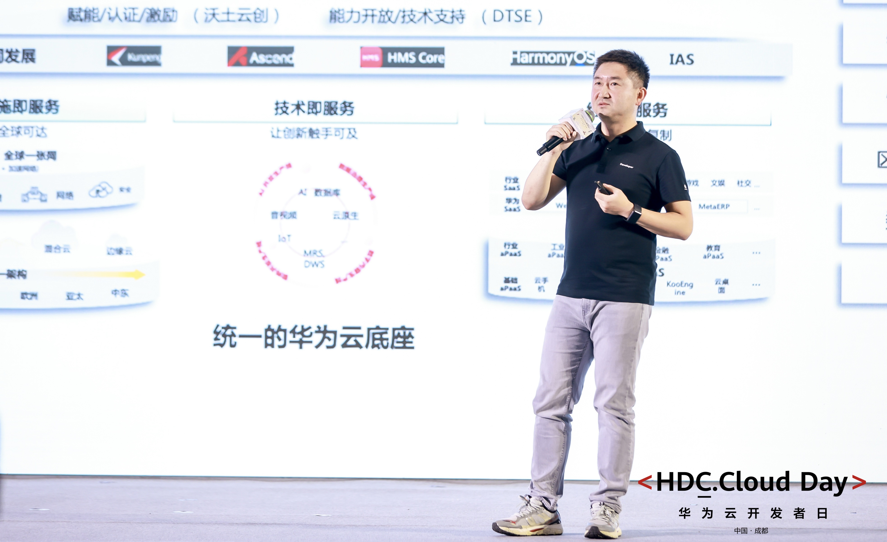

# ファーウェイのクラウド自律ストリーミングが開発者サークル運営に貢献する

> 開発者リレーションズの実務家たちにインタビューを行い、開発者リレーションズの定義について尋ねたところ、その多くが、開発者リレーションズチームは企業と開発者をつなぐ架け橋であり、リンクであると述べた。 一方では、開発者リレーションチームは、企業の技術を宣伝し、開発者に技術リソースを提供し、他方では、開発者の意見を収集し、研究開発チームにフィードバックし、開発者の体験を継続的に最適化することで、双方向のコミュニケーションを形成し、開発者の成功と製品の成功というWin-Winの状況を実現する。 したがって、開発者のユーザー操作は、開発者との関係構築の中核となる。 しかし、開発者のタイプやステージによって、ニーズや価値観が異なるため、差別化された運営戦略が重要である。
> 
> ファーウェイ・クラウドは毎年、大学、専門家、パートナーなど、さまざまなサークルやステージの開発者に、オープンで革新的、かつ多様な技術交流とビジネス成功の機会を提供している。 現在、Huawei Cloudは全世界で500万人以上の開発者と4万2000社以上のパートナーを抱え、Kunpeng、Shengteng、Hongmengなど複数の開発者エコシステムを共同でサポートしている。
> 
> このケーススタディでは、開発者サークルに関するHuawei Cloudのトップレベルの設計と運用戦略を分析する。この戦略は、さまざまな開発者向けにサークルを設計し、カスタマイズされたサービスを提供し、開発者とプラットフォームがWin-Winになるための重要な示唆を与えてくれる。

## Huawei Cloudストリーミング開発者サークル設計

開発者サークル運営の本質は、企業が異なるユーザーのニーズをよりよく満たし、開発者と長期的な協力関係を築くために、異なるステージとポートレートで開発者向けに差別化された運営戦略を採用することにある。

開発者の異なるステージに基づいて、Huawei Cloudは開発者を4つのサークルに分け、4つの異なるタイプの開発者のための垂直コミュニティを形成する：

* HCSD (Huawei Cloud Student Developers)**は学生開発者向けである。
  * HCSD は、Huawei Cloud の高等教育機関向けオープン・コミュニティ・プラットフォームとして、大学の教員や学生とクラウド・サービスを結びつけ、双方向の交流、学習コンテンツの共有、実践的なプロジェクト構築を通じて、クラウド・サービスの分野での学習とイノベーションを支援する。

* HCDG (Huawei Cloud Developer Group) ** 企業開発者とコミュニティ開発者向け
  * HCDG（Huawei Cloud Developer Community）は、Huawei Developer Ecologyがグローバルな開発者のために設立したオープンで革新的、かつ多様なコミュニティ組織である。 ベンチマーク活動には、オンラインHCDGワークショップとオフラインHCDGシティウォークが含まれる。

* HCDE (Huawei Cloud Developer Experts) ** エキスパート開発者およびエバンジェリスト向け
  * HCDE（Huawei Cloud Developer Experts）プログラムは、業界のオピニオン・リーダーや技術専門家のグループであり、開発者がファーウェイ・クラウドを理解し、利用することを支援することに重点を置いている。 現在、AIやビッグデータなど100以上の人気分野で1,000人以上のオピニオンリーダーがいる。 応募者には、企業のCEO、CTO、技術責任者、運用・保守責任者、アーキテクト、技術専門家、シニアエンジニア、事業分野の責任者などが含まれるが、これらに限定されない。

* ヘッドパートナー開発者向けルパン・セッション
  * Huawei Cloud Lupin Clubは、Huawei Cloudのハイエンド開発者コミュニティであり、コアパートナー開発者の技術交流、共同イノベーション、エコロジカルな開発者サークルの構築を目的としている。 HuaweiクラウドのSaaSパートナーやISVパートナーのCTO、アーキテクト、テクニカルディレクター、CEOなど、技術的なバックグラウンドを持つ人が応募できる。 当社の代表的なプログラムであるコア・パートナー・デベロッパー・ブートキャンプは、価値の高いパートナー開発者のためのブティック型トレーニング・プログラムである。 業界の優秀なメンターを招き、質問に答えたり、現在のソフトウェア業界の問題に対する解決策を議論したりする。

Huawei Cloudのサークル部門は、開発者がどのような段階にいても、プレッシャーを与えず、一緒に成長できる自分のサークルを見つけることができるという希望から始まった。 最終的には、開発者のライフサイクル全体をカバーするサークルフロー設計が形成された。 具体的には、学生開発者のためのHCSDは開発者コミュニティ全体の貯水池である。 将来、学生開発者が業界に足を踏み入れたら、企業開発者サークルのメンバーになり、企業開発者サークルでの継続的な成長を通じて、エキスパート開発者に昇格し、その後、意思決定権と影響力を持つパートナー開発者になる。

しかし、どのようにすれば開発者は自分のいる段階を正確に把握し、自分に最も適したコミュニティに参加できるのだろうか。 このようなサークルのために、ファーウェイクラウドは、開発者が自分のニーズを特定し、個人の能力を向上させるのに役立つ一連の主要な行動も設計した。

* 識別：Huawei Cloudは、異なるステージの開発者向けに異なるサークル活動を設計し、開発者が参加できるようにし、活動のアウトプットとフィードバックを通じて、開発者が自分のステージを判断し、ニーズを識別できるように支援する。 例えば、Huawei Cloudはコンテストやハンズオンラボなどのイベントを常に開催しており、開発者は達成したランキング、構築したアプリケーション、取得したコース認定によって、自分のステージを判断することができる。

* 成長: Huawei Cloudはまた、開発者が成長と革新のために学習できるよう、適切な学習リソースとサポートプログラムを提供している。 開発者は、参加を通じて技術サポートを受けるだけでなく、「Fertile Ground Cloud Creation Programme」を利用して、ファーウェイ・クラウドのエキスパートから、利用方法、デジタル・ソリューション、アプリケーション・イノベーションに関する技術サポートなど、マンツーマンの技術サポートを受けることもできる。 さらに、ファーウェイ・クラウド・アカデミーは、マイクロ認定や開発者認定など、さまざまなレベルの認定コースを提供している。

## ファーウェイ・クラウド・デベロッパー・サークル運営戦略

Huawei Cloudの開発者サークル運営の目標は、各サークルの運営を通じて、Huawei Cloudのオープンな機能と開発ツールで開発者に継続的に力を与え、開発者のイノベーションを可能にすることである。

Huawei Cloudの開発者サークル運営の目標は、各サークルの運営を通じてオープンな能力と開発ツールで開発者に力を与え、開発者のイノベーションを可能にすることである。

### トップレベルの戦略：3段階戦略

ファーウェイ・クラウド・デベロッパー・サークル運営のトップレベル戦略は、大きく3つのステップに分けられる：

- ステップ1 - **開発者仲間を探す**：異なるサークルの開発者が、同じくファーウェイクラウドを認識し、ファーウェイクラウドとともに成長する意欲のある開発者仲間を見つけるのを助ける。そうすることで、ファーウェイクラウドの技術的影響力を迅速に広め、製品とその開発能力を利用し、市場のリーダーとなり、製品デリバリーの反復を支援し、長期的に市場のニーズに適応できるようにする。 第2ステップ - **継続的なサービスと開発

- ステップ2 - **継続的なサービスとリソースのサポート**：サークルを通じてサークル内の開発者に価値あるサービスとリソースを継続的に提供し、実現可能な提案と信頼できるソリューションを提供し、双方向の価値を生み出す。

- ステップ3 - **共生と共同成長**: 開発者の成長がファーウェイクラウドの成長につながり、健全なエコシステムを共に構築する。

### サークル戦略：4つのサークルセグメント

前述したように、Huawei Cloudは開発者をそれぞれのステージに応じて4つのサークルに分け、4つの異なるタイプの開発者のための垂直コミュニティを形成する。 HCSDとHCDGは自律的なサークルであり、開発者がファーウェイクラウドから直接基本的なエンパワーメントを受けられるようにファーウェイクラウドが技術的なサポートを提供し、開発者が成長の過程でより多くの開発者を支援できるように、開発者が自発的に関連活動を組織できるように資金的なサポートを提供する。 HCDEとLupinは、優遇措置や特別支援など、より豊富な特典も提供する。 具体的な戦略は以下の通りである：

1.**HCSD：技術の基本的な影響に焦点を当てる
   HCSDは大学を中心に活動している。 一方では、HCSDは学生開発者にファーウェイのクラウド技術に関連するツールや製品を提供し、彼らが大学レベルで革新的なアプリケーションを構築するのを支援する。また、対応するコースや認定サービスも提供し、学生開発者の個人的な能力の成長を支援することで、将来的にファーウェイのクラウド技術のユーザーになる可能性を高める。 一方、HCSDは、学生と学生、開発者と開発者をつなぐことで、サークルの規模と影響力を拡大し続けたいと考えている。 例えば、定期的に大学でテクニカルサロンを開催し、学生の開発者にファーウェイのクラウド技術分野の開発能力や開発ツールについて学び、利用する機会を提供し、学生コミュニティに広めている。

2.**HCDG：技術のアプリケーションインパクトに焦点を当てる**。
   HCDGは都市単位で運営されている。 サークル活動を通じて、まず企業開発者コミュニティの間で組織文化が形成され、ファーウェイクラウドは各都市で技術力の共有、技術交換、需要交換などの活動を組織するために人々を支援するために継続的に投資する。 同時に、ファーウェイ・クラウドは一定の資金を提供し、企業内で意思決定能力を持つ開発者が自らのイニシアティブでより多くの都市コミュニティ活動を組織することを奨励し、より多くの開発者が技術エンパワーメント、技術共有、さらにはアプリケーション・イノベーションに関する議論や学習に参加するよう呼びかける。

3.**HCDE：技術に焦点を当てたグループの影響力**。
   より上級の技術者やエバンジェリストのために、Huawei Cloudは毎年、イベントへの特別招待、技術トライアル、その他の特典など、より多くのインセンティブとサポートを提供している。 ファーウェイクラウドは、これらのシニア技術開発者が技術サークルでの技術的影響力を活用することで、彼らがカバーする複数のサークルの開発者がファーウェイクラウドの技術を使用し、ファーウェイクラウドの技術を認識するよう促進し、ファーウェイクラウドの技術的影響力を拡大することを期待している。 同時に、エバンジェリストは業界のニーズを高いレベルで理解し、業界における実践を深く蓄積しているため、ファーウェイクラウドは彼らを製品カタライジングにおける重要な役割と見ており、エバンジェリストからの第一線の製品フィードバックが製品の継続的な反復に役立つことを期待している。

4.**ルパンクラブ：テクノロジーのビジネスインパクトに焦点を当てる**。
   ルパン倶楽部は、ファーウェイ・クラウドが力を入れているサークルで、テクノロジーからビジネスへの変革の魅力、つまり、開発者がファーウェイ・クラウドの機能をどのように利用すれば、投入コストを削減し、開発サイクルを短縮し、開発効率を向上させ、イノベーションの効果を高めることができるかに焦点を当てている。 このサークルでは、Huawei Cloudのパートナー開発者が、より多くの開発者がビジネスに迅速に適用できるように、特定のシナリオを組み合わせたオープンな機能とソリューションを提供する。 同時にルパンは、開発者と開発者、開発者とファーウェイの間にビジネス上のつながりを築き、開発者のビジネス成功の可能性を広げる。

## ファーウェイ・クラウド・デベロッパー・サークルの運営効果と今後の計画

現在、4つのサークルには約1万人のアクティブな開発者がおり、合計で少なくとも100万人の開発者を接続している。 具体的には、HCDEには100以上の技術分野をカバーする1,000人以上のエキスパート開発者と技術エバンジェリストがおり、HCDGは25都市の開発者をカバーすることに成功している。HCSDは200の大学をカバーしており、その多くにはコア学生開発者が運営するHuawei Cloud大学開発者コミュニティがある。

価値向上の面では、Huawei Cloud Developer Circleはサークル内の多くの開発者に力を与え、アプリケーション技術の革新と商業化の成果を効率的に達成するのに役立っている。 来年、ファーウェイクラウドは当初、HCDEが約1,200人の会員に達すると見積もっており、HCDGの対象都市を25から100に拡大し、毎年、開発者が独自に開催するイベントを200以上、HCSDがカバーする大学を300以上にする計画だ。 さらに、グローバル開発者向けの海外サークル活動も進行中である。

様々なサークルにおけるファーウェイクラウドの開発者コミュニティの継続的な成長とともに、様々なプロフィールの開発者のための差別化された運営戦略は実を結び始めており、クラウドサービス、開発者ツール、インフラソフトウェア・プロバイダー、その他開発者がユーザーや顧客である企業にとって、開発者運営の良い参考例を提供している。

*注：このケーススタディの執筆中にインタビューに応じてくれたファーウェイのクラウド・デベロッパー・エコシステム・オペレーション・ディレクターの胡志学氏に感謝する。
