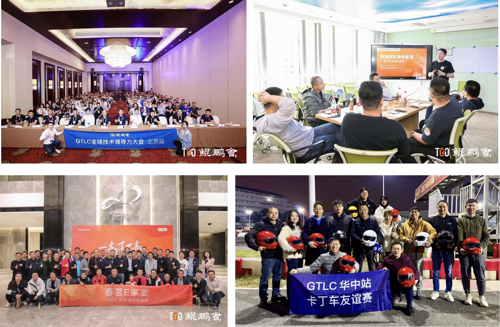

# テクノロジー・リーダーのコミュニティであるTGO KUNPENG SOCIETYはどのように運営されているのか？

> デジタルトランスフォーメーションの深化に伴い、企業の新技術に対する需要は高まっているが、技術調達の決定権は依然としてCレベルやITプロなど一部の上級技術管理者に集中している。 このような人々とのつながりを深めるため、多くのクラウド・コンピューティング・ベンダーや基本ソフトウェア・ベンダーは、マイクロソフトのMVPプログラムやテンセントのクラウドTVPプログラムなど、このような人々のためのハイエンド・コミュニティの設立を試みている。 しかし、ハイエンドの技術管理者を集め、維持するのは容易ではない。 質の高い、結束力のある技術リーダーのコミュニティをどのように構築し、それを企業の戦略的資産とするかは、すべての企業が解決すべき課題である。
> 
> TGO KUNPENG SOCIETYは、中国でも数少ないアクティブな技術リーダー・コミュニティとして、長年の育成の末に規模を形成した。 技術リーダーのコミュニティ運営に貴重な参考資料を提供してくれる。 本稿では、コミュニティの位置づけ、統治方式、活動方式、付加価値サービスなどの側面からTGOの運営を分析し、より多くの企業がハイエンド技術コミュニティを構築する際の参考となることを期待する。

## TGOクンペン協会の歴史と現状

### 東呉昆鵬会の歴史

TGO Kunpeng協会は2015年に設立された。 設立当初は、技術リーダーが交流し、学ぶためのプラットフォームを作りたいと考えていた。 8年間の運営を経て、この目標は変わることがない。

TGO訓鵬会の学生のキャリア形成過程も、中国のインターネットの発展過程を反映している。 初期の段階では、学生のほとんどがTo Cインターネット企業の出身だった。 中期になると、「大衆起業、大衆革新」の到来により、より多くのインターネット関係者が起業に参加するようになり、学生のほとんどがBtoBインターネット新興企業の技術起業家となっている。 モバイルインターネットの普及率が徐々にピークに達し、インターネット人材が溢れた後、より多くの人材が各業界に流れ始めた。 国家が計画した科学技術発展の方向性と相まって、現在、学生の30％は金融科学技術、製造業、新エネルギー、新消費などの数千の業界から集まっている。

### 東呉坤鵬会の現状

現在、TGO KUNPENG協会は北京、上海、杭州、南京、蘇州、武漢、成都、厦門、深圳、広州、シンガポール、シリコンバレー、台北を含む世界13都市に支部を設立し、合計1900人以上の学生が在籍しており、そのうちの73％は各企業のCTO、CIO、技術副社長、共同創業者、CEOであり、残りは各企業の技術幹部である、 TGOクンペンの年間平均更新率は80％以上である。 現在、学生の年会費は10,080元で、入会には旧学生の面接が必要である。

**東呉坤鵬会のビジョン、使命、価値観

TGO KUNPENG SOCIETYのビジョン：技術背景を持つ優秀な人材のためのグローバルな相互学習と成長プラットフォームを構築する。
TGO KUNPENG SOCIETYの使命：学生が優れた技術リーダーになるのを助ける。
TGO KUNPENG SOCIETYの価値観：学習意欲、共有意欲、相互達成、信頼。

## TGO KUNPENG SOCIETYのコミュニティ・ガバナンス
### 東呉鯤鵬会のガバナンス構造
#### ガバナンス・モデル

TGO KUNPENG ASSOCIATIONは設立以来、学生の共同創造と共同建設を厳守し、都市ごとに支部を設け、各支部に理事会を設置して支部の日常的な運営と発展を推進している。

* 支部：** TGO KUNPENG Societyは世界各地に13の都市支部を持ち、各都市支部には理事と理事会がある。
* 理事の責任は、理事会を率いて支部の日常運営と発展を推進することである。 理事会の中で、メンバーは学習チーム、奉仕チーム、開発チーム、監督チームなどに分かれ、理事会の機能を果たす。 理事会は定期的（1～2ヶ月）に開催され、支部の発展や各グループの健康状態について話し合い、次月の支部活動を計画する。
**グループ：*** 各支部にはいくつかのグループがあり、参加者8名につき平均1つのグループがある。 各グループのメンバーは月1回集まり、毎月のコミュニケーションとレビューを行う。
* 名誉研修生：** TGO KUNPENGは各界の著名人をTGO KUNPENGの名誉研修生として招聘する。 その目的は、各界の著名人とつながり、東呉坤鵬会の影響力を継続的に拡大することである。 同時に、名誉研修生が技術指導者との人脈を構築することにも役立っている。

#### 運営モデル（活動と内容の運営）

TGO Kunpeng Societyの代表的な活動は以下の通りである：

1.毎月の支部活動**。
   テーマ別学習活動、参加者共有活動、通い企業活動、非公開会議活動、カジュアルな家族活動などを含むが、これらに限定されない。

2.グループ活動
   各グループのメンバーは毎月1回集まり、月例交流と振り返りを行う。 テーマの交換と共有の後、過去1ヶ月の仕事、生活、自己開発、家族、健康などを含む毎月の自己レビューを行い、他のグループメンバーはコーチング性をレビューする学生にフィードバックを行い、学生がお互いに成長できるようにする。

3.**GTLC グローバル・テクノロジー・リーダーシップ会議
   GTLCカンファレンスは年間を通して数回開催され、毎年1回のメインカンファレンスは2日間開催される。 その他の開催地でも1日ずつ開催される。 GTLCは参加者が互いに学び、交流するためのイベントであり、TGOは著名なゲストや企業の創業者、技術リーダーを招き、参加者と経験を共有する。 共有内容の主な方向性は、最先端技術動向、経済発展動向、技術指導力強化などである。 テーマの広さについては、AI、海外進出、デジタルトランスフォーメーションなど、その時々に流行している様々なトピックが含まれる。

4.毎年恒例のファミリー・ディナー・イベント**。
   毎年年末と2年目の初め（春節の前）に、各都市の支部は毎年恒例のファミリー・ディナー・イベントを開催する。 毎年恒例のファミリー・ディナー・イベントは、1年間の激務を終えた参加者全員が一堂に会する場である。 雰囲気はリラックスしており、ネットワーキングを主眼とし、内容は補足的なもので、楽しい社交活動が適宜アレンジされる。 内容面では、TGOが有名な著名人を招き、1年の総括と来年の予測や展望を語ってもらうこともある。
   毎月のクラブ活動やGTLC大会では枠を公開し、学生が条件を満たした友人候補を誘い、活動終了後、TGO KUNPENGも適任者を誘う。

5.シリコンバレー・コネクション・ライブ・イベント
   シリコンバレー支部では、毎週火曜日に地元シリコンバレーの著名なゲスト（起業家、大企業の中核幹部）を招き、ビデオ中継を行う。 シリコンバレー現地のテックリーダー間の影響力を拡大し、シリコンバレーの最新最先端ニュースを中国のテックリーダーに紹介する。

6.クンペンスピーキングライブイベント**。
   定期的に学生を招き、ライブで接続し、ライブゲスト学生の分野を中心に話題を展開し、関連分野の情報を皆に紹介し、学生の個人ブランドと価値を広める。

#### オペレーションチーム

Geekbang Technologyには、TGO KUNPENG SOCIETYの運営をサポートする専門チームがあり、サポートチームには主に地域（都市）運営マネージャーとコンテンツ編集長がいる。 運営チームは主に基本的な会員管理、イベントや会議のプロジェクト管理、コンテンツ制作などを担当している。 東呉坤鵬協会のサービス綱領に従って、東呉坤鵬協会の運営をサポートする。 さらに、Geekbang Technologyは、東呉坤鋒協会の運営アプレットやその他のITサポートシステムの開発も担当している。 TGO KUNPENG協会の年間収入の一部は、運営チームの給与と賞与、基本的なプラットフォーム開発と運営費用に充てられる。

## TGOクンペン協会のコミュニティ発展

TGO KUNPENG SOCIETYに在籍する学生のほとんどは、古くからの学生からの推薦である。 彼らはTGOが提供する価値あるコンテンツや活動を実感できる一方、TGO KUNPENGで築かれたつながりの価値を手放したくないため、TGO KUNPENGに留まることを望んでいる。

#### 参加者の共同構築

TGO KUNPENG CLUBは設立以来、参加者共同建設の組織であることを主張しており、クラブのリーダー、理事、各グループのリーダーが開発に参加し、開発のための提案を行う。 例えば、GTLCの大会が開催されるたびに、大会が開催される地域のクラブの理事やグループリーダーで構成される大会組織委員会が設置される。 委員会のメンバーは、テーマの定義、プログラムの設定、共有すべきトピックの定義、ゲストの招聘などを担当する。 大会会場では、大会組織委員会のメンバーが大会の組織と司会に参加する。

TGO KUNPENGのメンバーが日々の運営に深く参加できるのは、彼らの文化や価値観があるからだ。 日々の活動の中で、「努力すればするほど得られるものが多い」、「自分の経験に責任を持つ」、「オフラインで会うよりオンラインで話した方がいい」などが私たちの文化となっている！ 私たちは私たちの文化の一部となっている。 参加者は皆、TGO KUNPENG SESSIONを、自分自身が参加して作り上げた商品として認識している。

#### 非営利団体である。

毎年徴収される会費はすべてTGO KUNPENG COUNCILの日々の運営と建設に使用される。 また、会計は学生に公開されている。

### TGO KUNPENG協会の生態学的価値

TGO Kunpeng Societyは、Geekbang Technology傘下のInfoQの有名ライター、InfoQがインタビューした有名ITゲスト、QConの司会者、プロデューサー、講師、GeekTimeの個人版の教師、GeekTimeの企業版のクライアントの技術指導者などを結びつけ、預けられるプラットフォームが存在することを願って設立された。 同時に、みんなのコミュニケーションプラットフォームを確立し、みんなとのつながりを強化し、長期的な協力関係を形成する。

TGO KUNPENG SOCIETYが設立した中国の技術リーダーをつなぐプラットフォームは、パートナーが各企業の技術意思決定者に効果的にアプローチするのにも役立つ。 TGO KUNPENG SOCIETYは、学生に価値をもたらすことを前提に、すべてのパートナーと協力することを望んでいる。 そのため、TGO KUNPENGは双方向のプラットフォームを提供する。

この事例を通して、技術指導コミュニティとしてのTGO KUNPENGの成功運営は、明確な目標位置づけ、柔軟な組織構造、豊富な活動内容、メンバーの高い参加率といった要素と切り離すことができないことがわかる。 中でも、自発性と相互支援はこのコミュニティの生命線である。 もし企業が同様のハイエンド人材コミュニティを設立したいのであれば、単に商業プロジェクトとして扱うのではなく、コミュニティの本質的価値に注目し、コミュニティ運営の法則を尊重し、持続可能な生態系を形成すべきである。

*注：Geekbang Technologyの副社長であり、TGO Kunpeng ClubのゼネラルマネージャーであるYang Pan氏に感謝する。 *
