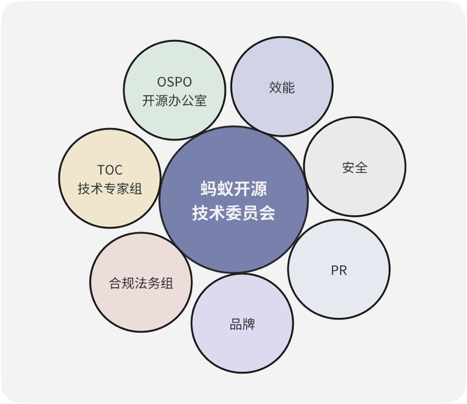
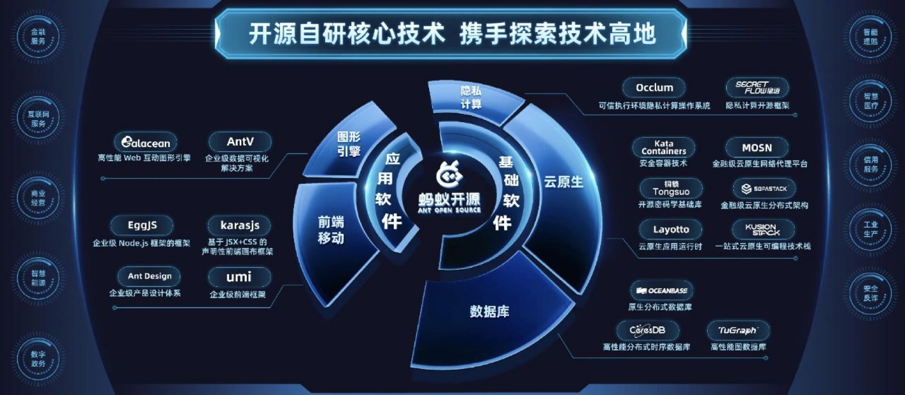
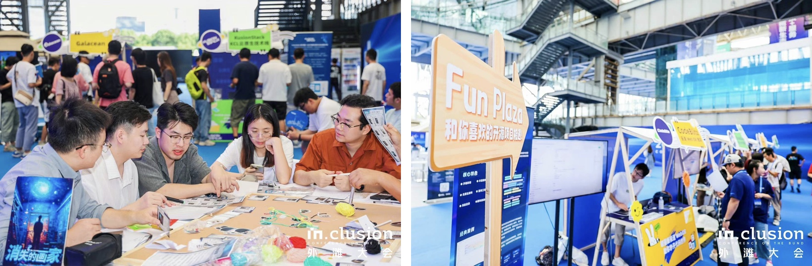

# アント・グループOSPO：オープンソースを企業技術成長の新たな原動力にする

>2023年5月、アント・グループ（Ant Group）は初めてオープンソース・オフィス（OSPO）を設立したと発表した。2023年5月、アント・グループは、主要な基本ソフトを核心とするオープンソースの完全なマップを初めて発表し、分散データベースOceanBase、暗号プライバシーコンピューティング技術スタック、TuGraphファミリグラフプラットフォーム、暗号技術「Copper Lock」などを含む包括的なインフラ技術のオープンソースを推進した。 「CopperLock "と他の核心自主開発技術を含む。 アント・オープンソースの包括的な発展の背後で、OSPOは重要な役割を果たしている。しかし、OSPOは中国ではまだ新しくニッチな組織であり、OSPOは企業の技術革新にどのような役割を果たすことができるのだろうか？ OSPOは企業の技術革新にどのような役割を果たすことができるのか。 オープンソースは企業の技術成長にどのような価値と意義をもたらすことができるのか。 アント・グループのOSPOの進化をケーススタディとして、その答えを導き出そう。

## アントグループのオープンソースオフィス(OSPO)の設立と発展

### OSPO の誕生：ビジネスニーズの急激な高まりから生まれた。

大企業では、オープンソースはしばしば複数のビジネスチームのボトムアップから芽生える。

フロントエンド領域は、Antオープンソースのパイオニアであり、最もよく知られているのはAnt Designプロジェクトであり、SegmentFault SegmentFault開発者コミュニティでは、antd関連タグの下にのみ、4000以上の技術Q&Aやコラム記事がある。 Ant Design、EggJSからAntVまで、Antのオープンソースプロジェクトは、コミュニティに現れ始めた。 コミュニティでの肯定的なフィードバックは、Antのオープンソースに対する意識と関心を高め、オープンソースの良い雰囲気を徐々に形成することを後押しした。

第二段階では、アントグループのToBビジネスの探求に伴い、SOFAStackのエンタープライズ中心からコミュニティ中心へのフルオープンソースは、MOSN、機密コンピューティングOcclumや他のクラウドネイティブネットワークエージェントのような多くのビジネス指向のバックエンドプロジェクトの大規模な実用的探求につながった。 現段階では、オープンソース化を試みるプロジェクトは多いが、オープンソースはむしろ推進されるべき選択肢である。

OceanBaseはアント・グループによって開発された分散データベースであり、過去10年間主にアント・グループ内部で使用され、ダブルイレブンなどの大規模な分散シナリオに耐えてきた。OceanBaseは、オープンソースがユーザーと製品開発チームを近づけることができ、より広いユーザーリーチとコミュニケーションを通じて、よりビジネス指向のバックエンドプロジェクトをフィルタリングできることに気づいた。 OceanBaseは、オープンソースがユーザーと製品開発チームの距離を縮め、より広いユーザーリーチとコミュニケーションを通じて、より多くの実際の製品価値要件をフィルタリングすることができ、また、コア機能の使いやすさを磨くのに役立つことに気づき、OceanBaseは2021年にオープンソースを選択した。2021年下半期に、アント・グループは「アント・オープンソース」のブランドを立ち上げ、アントがビジネス要求と結びついた戦略的牽引力を持つオープンソースの新たな段階に入ったことを示した。

アント・グループ・オープンソース・オフィスは、この戦略的探索段階の産物である。 企業のオープンソースオフィスの出現と発展は、しばしば技術戦略としてのオープンソースについての体系的な思考の始まりを示す。 コミュニティが発芽し、ビジネスが探索され、戦略的に選択されるプロセスから、しばしば企業内部のボトムアップ、大胆不敵な探索、野蛮な成長プロセスでもオープンソースであり、このプロセスはいくつかの問題とリスクを蓄積する。 数年後、企業は徐々にこの "痛点 "を認識し、それを自覚し、組織的に指導、ガバナンス、運営を提供し、さらには関連事業を調整する組織を設立する要求を形成する。

### OSPOの進化：サポートチームからビジネス志向のチームへの変革

エンタープライズオープンソース戦略の段階的な明確化とともに、アントグループのOSPOの進化は、おおよそ3つの段階を経てきた。

- 2021年、アントグループは、ガバナンスを主な責務とするオープンソースオフィスを設立する。

2021年2月、アントグループはオープンソースオフィスの正式設立を発表した。 ビジネスニーズから萌芽したOSPOは、当時、主に問題解決に焦点を当て、特に0から1の内部ガバナンスに関連する作業を完了するために、機密情報の漏洩を回避するための内部関連メカニズムやプロセスの確立、知的財産権の法的リスクの遵守などだけでなく、評価システムの確立を通じて、不明確な目標、品質の低下、オープンソースへの投資の保証の欠如を回避する。

- 2022年、オープンソースは会社の技術戦略となり、主な責任：プロジェクトのエンパワーメント**となる。

2022年、アント・グループのオープンソース推進室の機能は、過去1年間を踏まえ、ガバナンスを重視する業務から、運用を重視する業務へと変化する。 その主な業務は、社内の重要なプロジェクトがオープンソースのコールドスタートを行うための準備作業、生態系の拡大、開発者の経験の向上、オープンソースコミュニティのより健全で持続可能な発展の構築、継続的なイノベーションのオープンエコシステムにおけるプロジェクトの推進を支援することである。 2022年後半まで、アントグループはオープンソースをグループ戦略に引き上げ、最初の2段階では、オープンソースオフィスは、"コンピテンスセンター "と水平サポートチームの役割を果たしている。

- 2023年、オープンソース戦略をさらに明確にし、主な責任：オープンソース技術のブランディングとプロジェクト全体のインキュベーション**。

2023年、アント・グループはオープンソース戦略をさらに明確にした。 また、オープンソースオフィスは、オープンソース技術委員会の指導の下、技術の成長に焦点を当てたビジネス指向のチームに変身する。 この戦略では、アント・グループが開発者エコシステムを構築し続け、国際的な影響力を持つオープンソーステクノロジーブランドを創造し、コミュニティによって認知された一定数のトップクラスのプロジェクトをインキュベートすることを明記している。 第三段階に入ると、アントグループオープンソースオフィスは、企業のコアガバナンスセンターと運営センターの役割を果たすだけでなく、独自の独立した使命と目標を持っていることがわかる。

### アントグループオープンソースオフィスの探求と実践

### オープンソースを企業技術成長の新しい原動力にする。

アントグループオープンソースオフィスの新たな位置づけは、オープンソースを企業技術成長の新たな原動力にすることを約束する。

2023年9月のバンド会議で、アントグループオープンソース技術委員会副主席の王旭は、アントグループのオープンソース戦略を共有する際、技術成長について語った。 彼の意見では、オープンソースは企業にとって、メカニズム、影響力、信頼、コミュニティの4つの価値がある。 これらの4つの価値は、内部から外部へ、そして外部から内部へと推進され、結果としてコミュニティ主導の成長をもたらす。 そして、オープンソース・オフィスの使命に焦点を当てると、彼らの技術成長は2つの主要な次元に焦点を当てることになる、1つは量の増加であり、もう1つは質の向上である。

- 量の次元：テクノロジーを利用する人々の数は、多くのビジネス・ビジネスモデルの根底にある論理である。 他の条件がすべて同じであれば、それを認識する人の数は多ければ多いほどよい。 **

AliCloudビジネスを例にとってみよう。 アリクラウドのデータベース・テクノロジーは製品化され、クラウドのチャネルを通じて販売される。 この利益そのものがテクノロジーによってもたらされる。 核心となるのは、顧客がその技術を認識し、問題解決に役立つから、喜んでお金を払うということだ。 もし20％の人々がクラウド・ベンダーのテクノロジーを認識し購入すれば、そのうちの約80％が長期的なユーザーになるだろう。 クラウドベンダーは、人々の認知度に基づいて長期的かつ持続可能な技術開発を行うことができ、企業に利益をもたらす。

- オープンソースは触媒であり、化学反応そのものではない。 触媒には2つの役割があり、起こりそうもない化学反応を起こすか、起こった化学反応をより効率的にするかである。 **

OceanBaseを例にとると、2021年にOceanBaseがオープンソース化された後、現在のコミュニティ・バージョンは高品質で、本来であれば販売で拡大する必要があるアプリケーション・シナリオを広げ、顧客獲得コストを下げ、実際に利用するユーザーの規模を拡大している。 一方、アント・グループは、OceanBaseの300万行のコードすべてをオープンソース化し、データベース分野のビッグネームたちを惹きつけた。 彼らはOceanBaseの内部実装を直接見ることができ、技術的な信頼を高め、ブランドの信頼をさらに高めている。

### 組織の責任：コンプライアンスとセキュリティ、コスト削減と効率化、ビジネス開発

この使命を達成するために、アント・グループ・オープンソース・オフィスは3つの主要な責任を負う。

** アント・グループ・オープンソース・オフィスの第一の責任は、コンプライアンスと安全性を確保するために、会社が社内でソフトウェアのオープンソースを完成させるのを支援することである。 ** 外部へのオープンソースは複雑なプロセスであり、独立したプロセスではない。 OSPOの価値は、達成したい最終目標に従って、チーム横断的なコラボレーションを必要とするシステムやツールを体系的に構築できる点にある。設立当初のOSPOの主な仕事は、一連の仕組みを構築した上で、オープンソースの「やるべきこと」と「やってはいけないこと」を明確にし、適切なアドバイスをすることである。 OSPOの最初の仕事は、この仕組みを作り、オープンソースの「やるべきこと」と「やってはいけないこと」を明確にし、適切なガイダンスと重要なリスクに対する潜在的な警告を与えることである。

** 第二の責任は、コスト削減と効率化を達成するために、オープンソースコラボレーションのパラダイムを全体的なレベルでベストプラクティスに抽象化することである。 ** オープンソース・オフィスは、社内での開発者ツールのより良い使用、コミュニティとのより専門的なコミュニケーション、外部開発者とのコラボレーション、より効果的なコードの記述とレビュー、コミュニティが同意または不同意である技術的実装の議論、コスト削減と効率化というビジネス効果に到達するためのアーキテクチャレベルでのエンジニアリング経験とプロセス設計の完全なセットの形成を支援する。

**第3の責任は、外部のオープンソースコミュニティや財団と協力して、成熟したオープンソースプロジェクトのオープンなエコシステムを実現し、ビジネス開発を推進することである。 **

組織設計の面では、アント・グループは、オープンソース技術委員会とオープンソース事務局を持っている。 いくつかの企業内では、このような組織はほとんどがバーチャルな組織であり、組織のメンバーは社内の従業員を兼ねている。 一方、アント・グループは、物理的な組織と水平的なチームワークを組み合わせた設計を選択した。 オープンソースオフィスは正社員によって運営され、水平的な協力関係には、技術専門家グループ、法令遵守グループ、セキュリティグループ、ブランディンググループ、PRグループ、その他の専門分野のチームが含まれる。

### 標準化と個別化の矛盾を解決する：十分な活力を備えた汎用的なソリューションの創造

アント・グループのオープンソースオフィスは、主にオープンソース関連業務を一元化し、専門的な能力を提供できるチームを形成し、会社のオープンソース事業全体に貢献し、自身の専門的な能力を活かして突破口に焦点を当てる必要があるプロジェクトに個人的なサービスを提供する。 現在、アント・グループ・オープンソース・オフィスは、標準化された解決策を磨いてきたが、日常的な実践ではまだ2つの課題に直面している。

**例えば：あるプロジェクトチームは、プロジェクトを円滑にオープンソース化するために、簡単なケースを提供するだけでよい。 **しかし、カスタマイズされたサービスによるプロジェクト支援に集中するために、汎用的な要件をサポートするための時間コストをいかに最小化するかという別の課題も生じる。 **

この目標を達成し、ジェネリック・ソリューションとパーソナライズド・ソリューションの両方の有効性を最大化するために、アント・オープンソースは、基本的なドキュメントと、グローバルレベルで問題の大部分に対処する完全なシステムを提供し、積極的な反復と反応的な微調整によって内容を改善し続ける。 その中でも、ドキュメント自体がセルフサービスの「製品」であり、非常に強い生命力を持っている。商標のやり方、ライセンスの設計の仕方、社内で安全かつコンプライアンスに則った方法でコードをオープンソース化する方法、さらにはニッチなプロジェクトでも適切なケースを提供できる、完璧な方法論、コミュニティの運営計画など、すべてのプロジェクトのオープンソースにサービスを提供できる。 我々は、会社のすべてのプロジェクトのオープンソースにサービスを提供することができる。

## アントグループのオープンソースオフィスの有効性

アントグループオープンソースオフィスは、2年近くの探索の後、当初は「自信と目標を持って」内部のオープンソースを支援し、内部構築と外部探索の両方で一定の成果を達成した。

### 内部構築の成果

現在、アントグループオープンソースオフィスは、外部オープンソースの分野で、継続的に高品質のオープンソースプロジェクトを生産できる技術基盤を持っている。 ** この技術基盤は二つの部分から構成され、一つは、アントグループはオープンソース技術委員会の非常に完全なガバナンス機構を持っており、アントグループはすべてのオープンソースプロジェクトを非常に慎重に扱い、オープンソース技術評価チームは特別な採点表を持っており、技術の洗練度、セキュリティ、潜在的なリスク、オープンソースの価値（社会的および商業的価値）、コスト、オープンソースライセンスを遵守するかどうか、および他の次元の評価から。 評価する。 一方、アント・グループは、静的スキャンやコード解析といった一連のツールを開発し、レビューの効率化に役立てている。 もう一つの部分は、オープンソースの使用と導入において、OSPOは一般的に「オープンソース専門家サポート」のビジネスとセキュリティ側として登場し、開発者の経験の人間中心の視点を考慮する。 現在、OSPOは、社内のオープンソース導入とコンプライアンスシナリオのための方法論とツール設計において、すでに体系的な堆積を行っている。 また、アント・グループは、様々なニーズを持つ開発者のために、多くの階層別トレーニングコースを設けている。

最も難しいのは、プロジェクトを育成し、外部の生態系と統合することである。 国内のオープンソースの全体的な状況は、まだ「利用志向」の段階にあり、「オープンソースへの貢献」の推進には、まだまだ進歩の余地がある。 上流への還元、非同期コミュニケーション、ドキュメント重視」というオープンソースの方法論は、社内の技術開発効率と技術文化に直接役立つことができる。 オープンソースの文化と精神が技術文化に統合され、ビジネスシナリオの課題と結合されることができれば、高品質のオープンソースプロジェクトを体系的に一括して育成することは容易である。 現在、**アントグループは、プロジェクト上のすべてのオープンソースは、昨年と比較して、量の50％増と明らかな質的向上**がある。 同時に、アントグループ2020沈殿 "内部ソースコミュニティ "も血を形成する機能を果たし続けており、グループ内のオープンソースインキュベーターになる可能性を秘めている。

### 外部探索の成果

オープンソースプロジェクトは、企業の技術力を外部に投影するものである。 **アント・グループオープンソースオフィスは、2年間の努力**を通じて、アント・グループの技術とアント・グループがオープンソース化した技術を外部により完全に理解させることに成功し、その仕事の専門性とプロジェクトの品質**を通じて、アント・グループのオープンソース能力とオープンソースレベルが外部**に認められた。

**OSPOはまた、アント・グループのオープンソースコミュニティへの貢献について、外部がより包括的な認識を確立することを可能にする。 OSPOが設立される前、アント・オープンソースは、国内外の産業生態において多くの協力関係があった。 アントグループは、Openlnfra Foundationのプラチナメンバーであり、Linux Foundation、CNCF、Confidential Computing Consortiumなどのオープンソース組織にも深く参加し、協力している。 OSPO設立後、アント・オープンソースは、国内のオープンソースエコシステムとのコミュニケーションと協力をさらに強化し、長期的なウィンウィンのプロジェクト協力を追求する。 アントグループは、Open Atomオープンソース財団、CCFオープンソース開発委員会、ムーランコミュニティなどと長期的な協力計画を立てている。アントグループは、OSCARのTrusted Open Source Allianceに積極的に参加し、電子技術標準化研究所、中国情報通信技術研究院、金融分野の標準化組織が主導する様々なオープンソース標準に積極的に参加している。 新たな協力関係や事業展開も計画中である。

*(注: 内容は2023.5に起草されたもので、いくつかの新しいオープンソースプロジェクトはまだ含まれていない)*。

現在、Antグループは、20以上の主要なプロジェクト、1900以上のプロジェクトリポジトリを持ち、貢献者の総数は7000人以上に達し、包括的なプロジェクト活動と影響力は、中国で最も優れている。

## アント・オープンソースの未来

SegmentFaultの2021年と2023年の中国開発者関係実務者の現状調査において、オープンソースと開発者に対する企業の戦略の安定性と、関連業務の価値の測定は、常に関係実務者の2大問題であった。 アント・グループのオープンソース戦略に対する考え方とアント・グループオープンソースオフィスの関連分野での実践は、関連企業に良い参考例を提供することができる。

将来を見据えて、Antオープンソースはさらに3つの小さくも美しい目標を持っている。

1. **人間中心** であり続ける。
プロジェクトがより良く運営されるために汎用的なアプローチを使うという以前の希望と比べると、 Antグループオープンソースオフィスは、 オープンソースの全体的な能力でプロジェクトチームに力を与えることに、 より興味を持っている。 Antオープンソースは、開発者がオープンソースに参加し、オープンソースを理解し、オープンソースを認識し、Antを信じ、Antを選択することを支援することで、Antグループが国内の開発者にとってオープンソースを行う非常に良い選択肢となり、Antオープンソースがオープンソース開発者の最初の愛となることを望んでいる。 より多くのオープンソース人材を育成することで、より多くのオープンソース人材がより多くのオープンソースプロジェクトに貢献できるようにする。

1.**楽しさの本質に戻る**
開発者は、オープンソースの動機に参加し続ける多くの場合、Linuxのメンタリティの非常に先頭を無視した - ちょうど楽しみのために。今年のバンド会議では、オープンソースバザーを通じて、蟻のオープンソースは、オープンソースのスクリプトを殺すと他の楽しい小さな活動が正常にサークルのうち、開発者の多数の注目を集める。 これは、開発者が成長のためのオープンソースに貢献しながら、楽しみを得るための良い方法である。 アント・グループのオープンソース技術委員会の王旭副主席は、必ずしもすべてのプロジェクトにビジネス的な雰囲気があるわけではなく、実際、オープンソースには文化的な側面も多くあり、人々が交流し、共有することに意欲的になるはずだと述べた。 「オープンソースというものは、私たちはまだ楽しんでやりたいのだ。

1.**実用的な問題を解決する**。
アントグループオープンソースオフィスは、常に実用的な問題を解決し、会社に価値をもたらし、より多くの支持を得て、より多くの問題を解決し、より多くの人々を助けるために、長年にわたって着実に成長することができるように正確に、この実用的な問題は、ビジネス上の問題だけでなく、技術やコードのオープンソースを通じて解決することができる社会的な問題を含んでいない。 例えば、アント・グループは2023年、遠隔文字の解決策である「漢字拾灯プロジェクト」をオープンソース化し、遠隔文字のためにデジタルバンキングとデジタル政府システム全体から遮断されている中国の数千万人の既存ユーザーに救いの手を差し伸べることができる。このような社会的責任感のあるオープンソースは、アント・オープンソースが堅持してきた努力の方向性であろう。

*注：本件を執筆する過程でインタビューに応じてくれたアント・グループのオープンソース室長、卞思康氏に感謝する。
*本記事の一部は、中国情報通信技術研究院クラウドコンピューティング・ビッグデータ研究所Trusted Open Sourceが2023年9月に発行した「2023 OSPOケース大要」第2号からの引用である。 *
