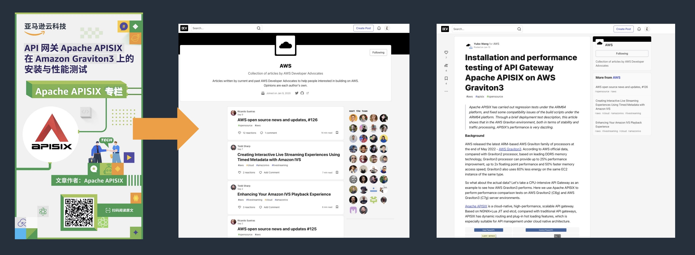
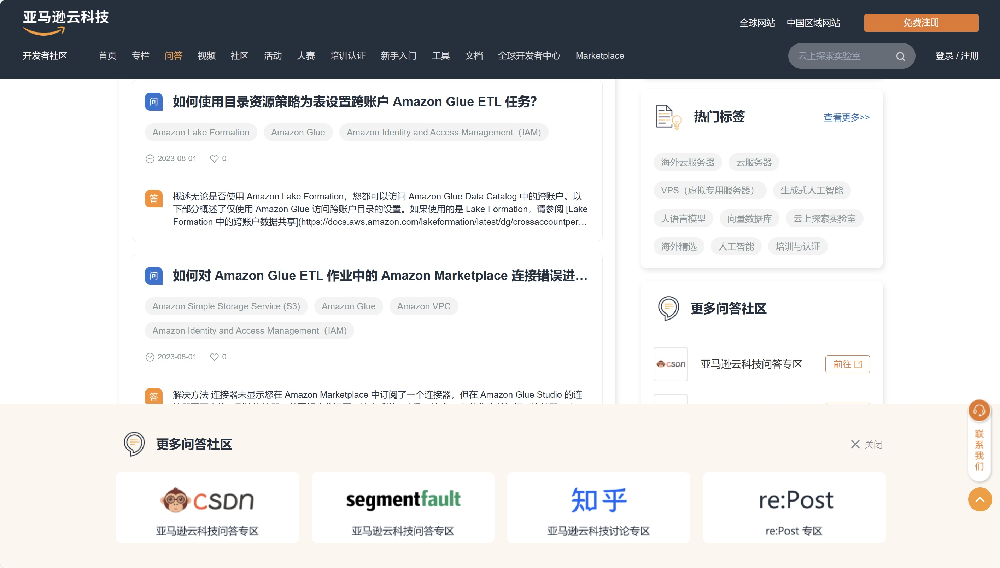

# クラウドコンピューティングの世界的リーダーであるAmazon CloudTechによる、ローカライズされた開発者コミュニティの構築

> ビジネス環境、言語、文化の大きな違いにより、中国の開発者はグローバルな技術リソースへのアクセスが困難である。 中国の開発者が学び成長するためのワンストッププラットフォームがない。中国の開発者はグローバルな開発者からある程度切り離されており、国際的なコミュニティとの連携や交流が不足している。
> 
> このような背景から、2022年10月、アマゾンクラウドテック開発者コミュニティ（https://dev.amazoncloud.cn/）の公式ウェブサイトが正式に開設された。 しかし、アマゾンクラウドテック・デベロッパーコミュニティは、大きなチャンスの一方で、ポストトラフィック時代の成長のジレンマや国内クラウドコンピューティングベンダーとの熾烈な競争など、大きな課題にも直面している。 今回、SegmentFault SiFaoは特別にAmazon CloudTech開発者コミュニティの公式ウェブサイトの「過去と現在」を調査し、差別化された競争戦略の下でのポストトラフィック時代の成長を探った。

## アマゾンクラウドテクノロジー中国開発者コミュニティのチャンスと課題

2013年に中国に進出して以来、アマゾンクラウドテックは今年で中国深耕10周年を迎える。 2023年アマゾンクラウドテック中国サミットで、アマゾンクラウドテックCEOアダム・セリプスキーは、「アマゾンクラウドテックにとって、中国は世界で最も戦略的に重要な地域の一つであり、これまでもそうであったし、これからもそうであろう！ 「と述べ、アマゾン・クラウドがグローバル・テクノロジーを現地に根付かせ続けるという戦略的野心を示している。

中国には独自のビジネス、文化、言語環境があり、中国の開発者向けコミュニティはアマゾンクラウドの戦略における重要なステップであるだけでなく、「ユーザー中心」の理念を伝える重要な担い手でもある。 コミュニティの設立は、ドキュメント、ブログ、チュートリアルなどの技術コンテンツのローカライズや、現地の技術的なアプリケーションシナリオに即したソリューション、より機敏な対応サービスやより効率的なユーザーサポートなど、ローカライズの問題をある程度解決するだろう。

しかし、アマゾン・クラウド・テクノロジーは、次のようなジレンマにも直面している。

- 国内ベンダーのローカライゼーションにおける優位性：Amazon CloudTechが中国の開発者向けウェブサイトの構築を決定する以前から、国内の主要クラウドベンダーは独自の開発者コミュニティを持っていた。 中国の開発者エコシステムを最も早く構築した阿里雲は、開発者のコンテンツ、ツール、プラットフォームなどのワンストップ需要に応えるため、開発者コミュニティのDeveloper Centre、Cloud Community、阿里雲MVP、阿里雲大学、天地などの開発者サービスの統合とアップグレードまで完了し、阿里雲開発者コミュニティの2.0時代に足を踏み入れた。

- 三者コミュニティはより成熟している：**アマゾンクラウドの開発者コミュニティは中国でかなり活発だが、関連する技術コンテンツや活動は通常、豊富なリソースの蓄積と成熟したコミュニティ環境を持つ中国の三者技術コミュニティに散在している。 開発者は長い間、これらのプラットフォームでの技術的なコミュニケーションや共有に慣れている。 これはまた、中国の開発者がAmazonクラウドが中国の開発者向けに提供するグローバルな技術リソースを明確に理解し、迅速に適用することを難しくしている。

- **成長問題はより深刻になっている:** ウェブがポストトラフィック時代に突入するにつれ、継続的に増加するユーザー増加圧力と、ますます高価になるトラフィックとの矛盾が浮き彫りになっている。 しかし、ソフトウェア・サービスの購買決定権は、Cレベルから第一線の開発者へと徐々に移行している。 市場シェアを拡大したいテクノロジー・ベンダーは、顧客からの受注を継続的に獲得するために、開発者の信頼を築く必要がある。

そのため、技術的な知識やベストプラクティスの交換を促進し、より緊密で活発なワンストップの中国開発者コミュニティを構築することが、アマゾンクラウドテクノロジーにとって、中国の開発者が価値を獲得し、彼らとの信頼を築くための最良の選択となっている。

2023年、アマゾンクラウドテクノロジーは公式の中国開発者コミュニティサイトをリリースした。アマゾンクラウドテクノロジーのグローバルなクラウドリソースで中国の開発者が成功するために、中国開発者コミュニティを構築することで、開発者との関係を強化し、開発者の成長を支援し、より多くのクラウドコンピューティング人材を育成することを目指している。

### Amazon.com 開発者コミュニティ発展戦略

### コミュニティの位置づけ：ワールドクラスの開発者コミュニティ

アマゾン・クラウド・テクノロジーは、中国の開発者がアマゾン・クラウド・テクノロジーの世界クラスのクラウドリソースで成功するのを支援するために、中国の開発者コミュニティサイトを世界クラスの開発者コミュニティと位置づけている。 具体的には、Amazon CloudTechの開発者コミュニティサイトは、中国のクラウド開発者に以下のような価値を提供している：

- 世界最先端のクラウド知識とスキル（クラウド・コンピューティング技術開発のトレンド知識のあらゆる次元をカバーし、世界有数のトレーニング認定制度がある）
- グローバルなクラウドコンピューティングリソースへのアクセス（クラウドコンピューティング関連のグローバルリソースの統合、グローバルコミュニティリソースと成果の共有）
- グローバルなクラウドコミュニティへのアクセスと露出の機会（グローバルなオピニオンリーダーや成功した企業、技術、開発者をつなぐことで、グローバルな露出の機会を得る。）

つまり、中国のクラウド開発者が世界の最先端技術、意見、プロジェクトとつながり、中国の優れた開発者や技術を世界のクラウドコミュニティに推薦するためのワンストッププラットフォームをユーザーに提供することである。

ユーザーのプロファイリングに関しては、コミュニティは中国のクラウド開発者を個人開発者、企業開発者、エコ開発者に分けている。 個人開発者へのサポートは、最先端のクラウド知識／スキルの習得を支援する個人的な向上に重点を置き、企業開発者へのサポートは、従来の開発者がクラウド開発者に移行するのを支援するキャリアアップに重点を置き、エコ開発者へのサポートは、製品や技術を海外に普及させ、海外での商業化を模索する海外進出の支援に重点を置く。

### 差別化された価値を増幅させる：取り込む＋持ち出す

アマゾンクラウドの開発者コミュニティ構築の取り組みは、中国の開発者の成長から成功までのライフサイクル全体をカバーしており、差別化された価値の中核は、「取り込む」と「出て行く」の2つの部分にある：

* 導入：開発者の利益のために、グローバルなリソースやコンテンツをローカライズし、中国語で提供するワンストッププラットフォームを構築する。 **
  ** 中国開発者コミュニティの公式ウェブサイトは、グローバル・コミュニティ・センターと協力し、グローバルなクラウド・コンピューティング・リソース、中国にローカライズされたコミュニティ・リソース、スタートガイド、ツール、ドキュメント、技術事例、書籍などのほか、国際標準に沿ったプロフェッショナル・コースや認定制度など、クラウド・リソースのグローバル化のサポートを中国の開発者に提供する。 同時に、開発者は、コラム、Q&A、ビデオ、その他のセクションを通じて、グローバルで膨大な技術的なドライ中国語コンテンツにアクセスし、前進する能力を達成することができる。 ビデオセクションを例にとると、ケース共有、実習、サミットスピーチ、人物インタビュー、製品技術、トレーニング、職場など、合計7つのカテゴリと数百の技術ラベルの選択が含まれる。 開発者は、ビデオコラムから具体的な技術実践の指針を得ることができるだけでなく、Javaの父、ジェームズ・ゴスリング博士や他の技術的な達人たちの、将来の技術動向に関する判断を見ることもできる。
  * 開発者コミュニティの公式ウェブサイトは、中国の開発者向けに特別に調整されており、地域のTech Talk、Build On、Meetup、Community Day、Dev Dayやその他の豊富な開発者向けアクティビティで、開発者の学習経験を豊かにする。 ハッカソン、アプリ・チャレンジ、Amazon DeepRacer、その他の多様なイベントは、開発者に幅広いアプリケーション・スペースを提供するために、サードパーティによって共同で開催されている。
  * 中国開発者コミュニティの公式ウェブサイトは、アマゾンクラウドテクノロジーのグローバルコミュニティの力を活用し、中国の開発者が世界中のクラウド技術に基づいて開発された成功企業の中核となる人々とつながり、グローバルな開発者プロジェクトや活動に参加するための、より便利な道を提供する。

**Going Global: 中国の優れた開発者と技術をグローバルなクラウドコミュニティに推薦し、彼らが海外での商業化モデルを模索し、成功を収めるのを支援する。 **
  * 中国の開発者やパートナーのための技術コラムを構築し、質の高い技術コンテンツをグローバル・コミュニティに発信し、中国の技術ブランドのグローバル化を支援する。

> 事例：APISIXの技術ブログをアマゾン・クラウドテックのグローバル・コミュニティに提供する

Amazon CloudTechのグローバル・マーケットプレイス・リソースを活用することで、中国の開発者はAmazon CloudTechパートナー・ネットワーク（APN）に参加したり、Amazon CloudTechマーケットプレイスを通じて幅広いグローバル・コミュニティーのサービスにアクセスすることができる。 中国の開発者の技術コンテンツは、海外のコミュニティで公開することもでき、中国の技術がグローバル化するのを支援する。 成功例としては、コミュニティの最も重要な部分の1つであるAmazon Cloud Heroesプログラムがあり、現在世界で活動している255人のHeroのうち16人が中華圏の出身者である。 その中でも、SphereExのCTOでアマゾンクラウドテクノロジーのデータヒーローであるJuan Pan氏は、2023 re:Inventのステージに登場し、中国の開発者の技術力を世界の開発者に示すことに成功した。

SphereExのCTOでありアマゾンクラウドテクノロジーのデータヒーローであるホアン・パンは、2023 re:Inventのステージに立ち、中国の開発者の力を世界に示すことに成功した。 

> データヒーロー、スフィアエックスCTO、アマゾンクラウドテクノロジーのパン・ファン氏がre:Invent 2023で講演した。

- 我々は、ユーザーグループを通じてアマゾンクラウドテクノロジーのグローバルコミュニティネットワークを構築し、中国の開発者が世界のあらゆる地域、あらゆる領域の開発者とリンクできるようにしている。 このコミュニティは、全世界で400以上の組織と700人以上のリーダーを擁し、100以上の国と地域をカバーし、50万人以上のアクティブユーザーを抱えており、そのうち中国の15都市にはすでにUser Groupが存在する。

### 革新的な「ワンサイド・プラットフォーム＋スリーサイド・コミュニティ」モデル

三者コミュニティの主流を背景に、アマゾンクラウドは「一つのプラットフォーム＋三者コミュニティ」という革新的なモデルを作り上げた。 ワンプラットフォームとはアマゾン独自の開発者コミュニティの公式サイトを指し、三者コミュニティとはサードパーティの開発者コミュニティを指す。

アマゾン・クラウド・テクノロジーは、開発者コミュニティの公式ウェブサイトを通じて、地域に根ざした膨大な技術リソースを集約することを基本に、「コミュニティは開発者のものであり、アマゾンのものではない」と常に主張してきた。 オープンという原則を守り、コミュニティはSegmentFault、CSDN、その他の国内主流の開発者コミュニティ、Amazon Cloud Technology Global Technology Forumの入り口を提供し、開発者の好みを尊重し、開発者がよりよく学び、コンテンツを共有できるよう支援している。

*Amazon CloudTech Developer Community公式ウェブサイトは、より多くのQ&Aコミュニティに接続している。

SegmentFaultを例にとると、SegmentFaultコミュニティには、Amazon Cloud Techに関連する技術Q&A、技術記事などがすでに数千件ある。 今年のre:Invent 2023グローバル・テクノロジー・カンファレンスの後、多くのコミュニティ開発者がサードパーティコミュニティでUGCコンテンツのアウトプットを開始し、re:Inventで新製品やリリースのスニークプレビューを自発的に共有した。

## アマゾンクラウドテクノロジー開発者コミュニティ公式サイト構築結果

アマゾンクラウドテクノロジー開発者コミュニティの公式ウェブサイトは、グローバルコミュニティのグローバルリソースと先進的なコンテンツを利用することで、開発者を引き付け、維持し続ける一方、中国の開発者向けにローカライズされたコンテンツをカスタマイズし、開発者に実用的なソリューションを提供し、同時に、オープンな姿勢で現地の成熟した三者コミュニティと協力することで、開発者のフィードバックチャネルを拡大している。 また、成熟した三者コミュニティとトラフィックを奪い合うという奇妙な循環から抜け出し、ユーザーと技術の秩序ある流れを実現し、より健全な開発者関係を促進した。

現在までに、Amazon Cloud Developer Communityの公式ウェブサイトは、国内外で2,300本の技術記事を掲載し、開発者と顧客パートナーが50本以上のコラムを開設するのを支援した。 また、開発者向けに548本の技術ビデオを制作し、年間を通じて344の開発者向けイベントを開催し、16,000人以上の開発者をオンラインおよびオフラインの技術活動に参加させてきた。 同社は、差別化された競争戦略のもとでゲームに勝つ能力を十分に発揮しており、国際的な大企業による中国でのローカル開発者コミュニティの構築に良い参考例を提供している。

*注：本ケーススタディの執筆にあたり、インタビューにご協力いただいたアマゾンクラウドテクノロジーのシニアデベロッパーオペレーションスペシャリスト、郭躍氏に感謝申し上げる。
