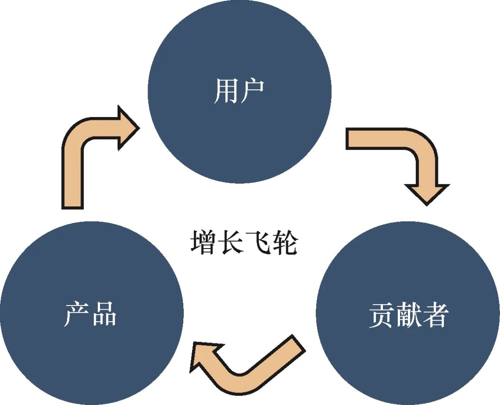
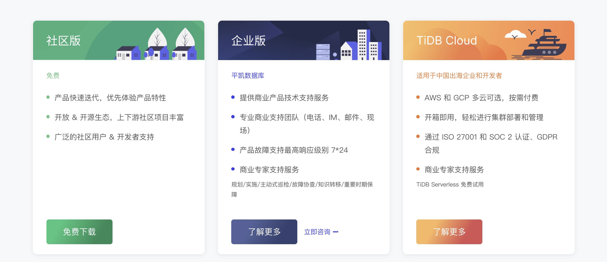
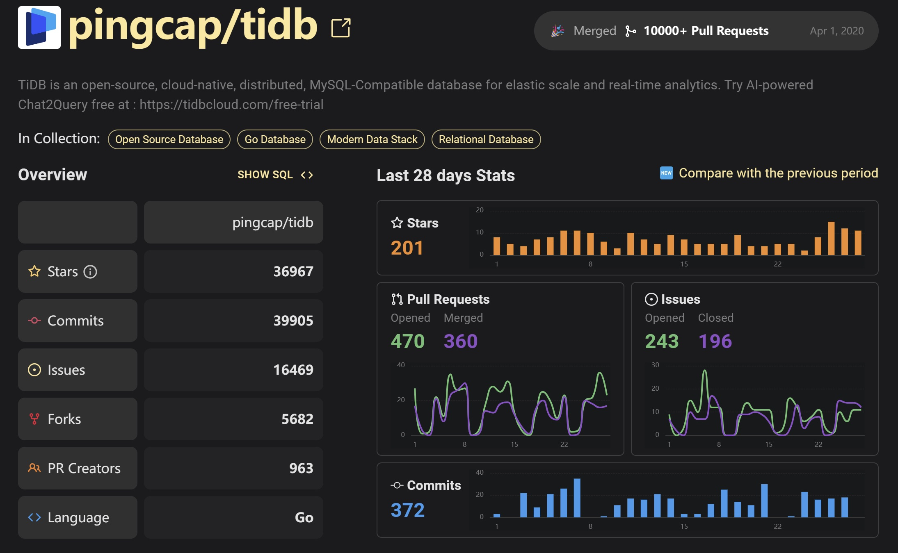

# コミュニティ主導で、PingCAPのグローバルなオープンソースエコシステムとビジネスの成長を築く

> デジタル化の波に後押しされ、オープンソースコミュニティはイノベーションの重要な源泉となっている。 非常に活発なオープンソースコミュニティに依存して、TiDBはその豊富なアプリケーションシナリオを拡大し続け、急速に中国人が主導する国際的なトップオープンソース分散データベースプロジェクトとなった。 PingCAPはオープンソースを会社の核心戦略とし、グローバル化戦略とともに推進し、中国のデータベース製品を積極的に推進し、世界的に技術的なリーダーシップと商業的な受容を獲得し、かつてこの分野における融資の最高記録を打ち立てた。
>PingCAPのサクセス・ストーリーは、オープン・コラボレーション・モデルを通じて自己強化型エコシステムを構築する方法を鮮明に示している。 DevRelの観点では、これは単なる技術的なブレークスルーではなく、市場とコミュニティへの関与戦略の進化でもある。 本稿では、PingCAPがオープンソースの精神を守りながら、DevRelの優れた実践を通じて、製品、ユーザーベース、貢献者の間で独自の成長のフライホイールを回し続け、最終的に同社の継続的なイノベーションとビジネスの成功に貢献していることを紹介する。

## オープンソースコミュニティの成功：TiDBの成長フライホイール

PingCAPの理解では、オープンソースコミュニティは、プロダクト、ユーザーベース、コントリビューターから構成される。 これら3つの構成要素は静的なものではなく、常に回転するフライホイールを形成している。

簡単に言えば、オープンソースコミュニティは、製品開発を検証し、正しい方向へ推進するのに十分なシナリオを持っており、ユーザーのニーズを満たすより速い反復的な製品は、採用の敷居とコストを下げ、ユーザー数の増加をさらに促進する。 フライホイールが回転するたびに、より幅広いアプリケーションシナリオ、より成熟した製品、より強力なコミュニティがもたらされる。

PingCAPコミュニティ・エコロジーの仕事もこの3つの要素を中心に展開されており、コミュニティ運営チームは内部で3つの異なる役割変容の段階を経てきた。 第一段階では、彼が率いるチームは主にオープンソースコミュニティに焦点を当て、オープンソース貢献者のコラボレーション体験の向上に集中した。第二段階では、PingCAPが商業化を試み始めてから、オープンソース貢献者を対象とした運営業務の割合が増え始めた。 第二段階では、PingCAPが商業化を試み始めてから、オープンソース貢献者を対象とした運用業務の割合が減少し始め、オープンソースコミュニティ全体のユーザーにサービスを提供し、対応する本番環境でコミュニティ版のTiDBを使用できるように支援する傾向が強まり、第三段階の現在は、製品の本質に立ち返り、製品を使用するエンドユーザーに焦点を当て、製品のエクスペリエンスを向上させることに専念し、開発者のエクスペリエンスと開発者との関係に焦点を当てている。

実際、この成長フライホイールにおいて、核となるのは開発者の経験である。良い使い方がファネルのコンバージョン率を決定し、フライホイールを回転させる原動力となるのだ。

## 商業化の探究：DevRelは企業のSLG＋PLG戦略の実現を支援する

基本的なソフトウェア企業として、コミュニティの成功だけでは十分ではなく、コミュニティの成功を商業的成功にどのようにつなげるかは、オープンソースの商業企業が成長する上で避けて通れない課題である。 PingCAPの商業化戦略は、その製品提供モデルを通して見ることができる。

PingCAPは、コミュニティ版、エンタープライズ版、クラウド版の製品マトリックスを形成している。

- コミュニティ版による迅速な製品の反復：PingCAPはコミュニティ版を通じて、急速に変化する市場の需要に適応するため、俊敏なリリースペースを維持している。同時に、PingCAPはTiDBとそのオープンソースコミュニティの豊富なコンテンツと活動を通じて、ターゲットユーザーに製品を知ってもらい、興味を持ってもらい、価値評価と購買決定に影響を与え続けている；

- エンタープライズエディションによる安定したサービスの提供：実際のビジネスシナリオによって磨かれた製品は、より安定した可用性の高いサービスと革新的なサポートをターゲットユーザーに提供し、価値提供を完成させることができる；

- クラウド版を通じてグローバルに展開：TiDBクラウドはクラウド技術に基づき、すぐに利用できるDBaaSサービスを提供し、PBレベルのデータベースサービスプラットフォーム全体の価値をさらに増幅させる。

**PingCAPのアプローチは、中級顧客向けのユーザージャーニー設計を例に挙げると**、ユーザーに初期段階で無料クレジットを提供し、製品を深く理解し、よく使い、製品開発経験を維持するよう導く。そして、ユーザーが本当に製品を使い、ビジネスが成長したときに、彼らをフォローアップするセールスリードに転換し、より効率的なビジネスモデルを形成する。

大口顧客向けのSLG（Sales-Driven Growth）モデルだけに頼っていると、市場が徐々に飽和したときに成長のボトルネックに遭遇する可能性があり、ユーザー獲得コストは上昇し続けることが証明されている。

TiDBクラウド・サーバーレスの誕生は、PingCAPがプロダクト・ドリブン・グロース（PLG）戦略に移行するための重要なステップだ。 PLGモデルは、製品の価値と使いやすさを活かしてユーザーを惹きつけ、開発者の体験を最適化し、製品を試す障壁を下げ、ユーザーの満足度と口コミによる自然な成長を促すことに重点を置く。

一方、SLGモデルは、大企業特有のニーズを満たすカスタマイズ・ソリューションとハイレベルなサポートを提供することで、企業レベルの顧客を育成することに重点を置いている。

PLGとSLGを組み合わせることで、PingCAPは両モデルの長所を取り込むことを目指している。PLGは新規ユーザーの参入障壁を低くし、迅速な拡大と市場浸透を可能にし、潜在的なマーケティングコストを削減する。

## グローバル製品＋ローカル・コミュニティ

PingCAPは創業以来、国際化のコンセプトを堅持してきたが、グローバル化への道のりでは多くの困難に直面してきた。 EU加盟国を例にとると、加盟国は比較的小さいものの、その数は非常に多く、GDPR（EU一般データ保護規則）も非常に厳しい。また、例えばインドネシアは多くの島々から構成されており、自然災害に対応するためには、数百キロ離れた場所にデータをアーカイブする必要がある。さらに、日本は自然災害の多い国であり、津波や地震が頻繁に発生するため、地域をまたいだデータのバックアップも必要になる。 また、日本は自然災害が多く、津波や地震が頻繁に発生するため、地域をまたいだデータのバックアップも必要になる。パブリッククラウドベンダーは通常、データの一部を東京に置き、一部を大阪に置く。 そのため、TiDBは地域をまたいだデータのディザスタリカバリにも対応しなければならない。 さらに、購買決定チェーンは国によって異なる。

PingCAPはすぐに、中国での経験がヨーロッパやアメリカ、その他のグローバル市場では再現できないことに気づいた。 グローバル製品とは、PingCAPの開発者が独自の製品を開発・管理できることを意味する。

- グローバル製品とは、PingCAPが様々な国際市場のニーズを満たすために、地理的・文化的境界を越えた汎用的なソフトウェア・ソリューションを開発することを意味する。

- 多用途性と適応性**：製品は、高いスケーラビリティ、回復力、耐障害性を備えたグローバルユーザーのコアニーズを満たすように設計されており、どこに配備されても同じ効率的な機能を提供する。

- 国際化対応**：ソフトウェアは多言語に対応し、国際標準に準拠しているため、グローバル・ユーザーのアクセシビリティを確保する。

- コンプライアンスとセキュリティ**：さまざまな国や地域のデータ保護規制や基準に準拠し、世界中の顧客の信頼を得るために必要なセキュリティ機能を提供する。

- ローカライズされたコミュニティとは、各ターゲット市場において、ローカライズされたサポート、リソース、カスタマイズされたサービスを提供できるローカル・コミュニティを構築し、育成することを意味する。 地域によって異なるニーズに対応するため、PingCAPは地域のデベロッパーコミュニティマネージャーという重要な役割を通じて、地域のユーザーグループとつながり、開発者とのコミュニケーションを維持し、アクティブな開発者からのフィードバックを生産チームと研究チームにタイムリーに提供して分析することで、必要な要件を抽象化し、それを製品に実装することで、グローバルに一貫した開発体験を形成する。 TiDBはすでに、以下のような幅広いサービスを開発者に提供している。

現在、TiDBは、中国、米国、欧州、日本、東南アジア、インド、その他の国や地域の3,000社以上の企業にサービスを提供しており、金融、オペレーター、製造、小売、インターネット、政府など、さまざまな業種が関与している。TiDBは、GitHubで合計35.4k以上のスターを獲得しており、オープンソースコントリビューターの累計は1,785人を超えている。TiDBプロジェクトは26,000以上のPull Requestをマージし、13,000以上のIssueを解決した。

TiDBプロジェクトでは、26,000以上のPull Requestがマージされ、13,000以上のIssuesが解決されている。

TiDBのオープンソースプロジェクトから、グローバルな製品とローカライズされたコミュニティの相乗的な成長まで、PingCAPの経験はオープンソースと商業化の調和を示している。 PingCAPは、強力なコミュニティ・ダイナミクスを刺激するだけでなく、企業に確かな商業的成果をもたらしている。 DevRelの実践者として、我々はPingCAPの実践からインスピレーションを得るべきである。 オープンソースの世界であれ、商業の場であれ、DevRelは製品とユーザー、技術と市場、企業とコミュニティをつなぐ架け橋であり、それが今日のTiDBを作り上げ、明日の無限の可能性をもたらしているのである。

*注：このケーススタディの執筆にあたり、インタビューに応じてくれたPingCAPのグローバル・コミュニティ＆デベロッパー・エクスペリエンス責任者、ウェイ・ヤオ氏に感謝する。
*この記事の一部は、記事「オープンソースの商業化7年、なぜPingCAPはそのような道を選んだのか」から引用している。https://cn.pingcap.com/article/post/229.html*
